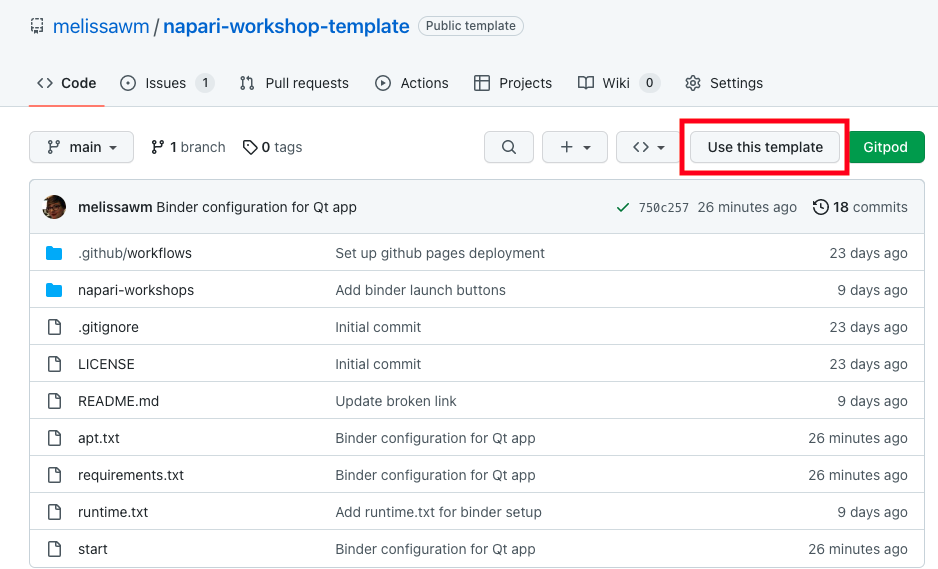

# napari-workshop-template

A JupyterBook template for napari workshops.

**To see the built website, go to
https://<your_github_username>.github.io/napari-workshop-template**. For
example, see this template [here](https://napari.org/napari-workshop-template/home.html).

**To see a live version where you can execute the notebooks on your browser, use ** (make sure this link points to your own repository!)

## What is this repository?

This repository is meant to be [forked](https://docs.github.com/en/get-started/quickstart/fork-a-repo) and edited so that you have a starting point when creating your own napari workshop. All instructions below are meant to be executed _on your own fork_, so that you have a copy of the template that you can adjust to your needs.

You can also click the `Use this template` button in the GitHub web interface for this repository:

Once you have created your workshop, if you would like the event to be listed [in napari.org](https://napari.org/stable/further-resources/napari-workshops.html), feel free to submit a pull request to https://github.com/napari/docs

## Documentation

To learn more about how to build, publish, share and cite your workshop materials, check the [Build your own workshop section](https://napari.github.io/napari-workshop-template/docs/build_your_workshop.html).

## Contributing to this repository

If you find typos, incomplete or misleading instructions, or have suggestions for improvements to this template, open an issue at the napari/napari-workshop-template repo.
