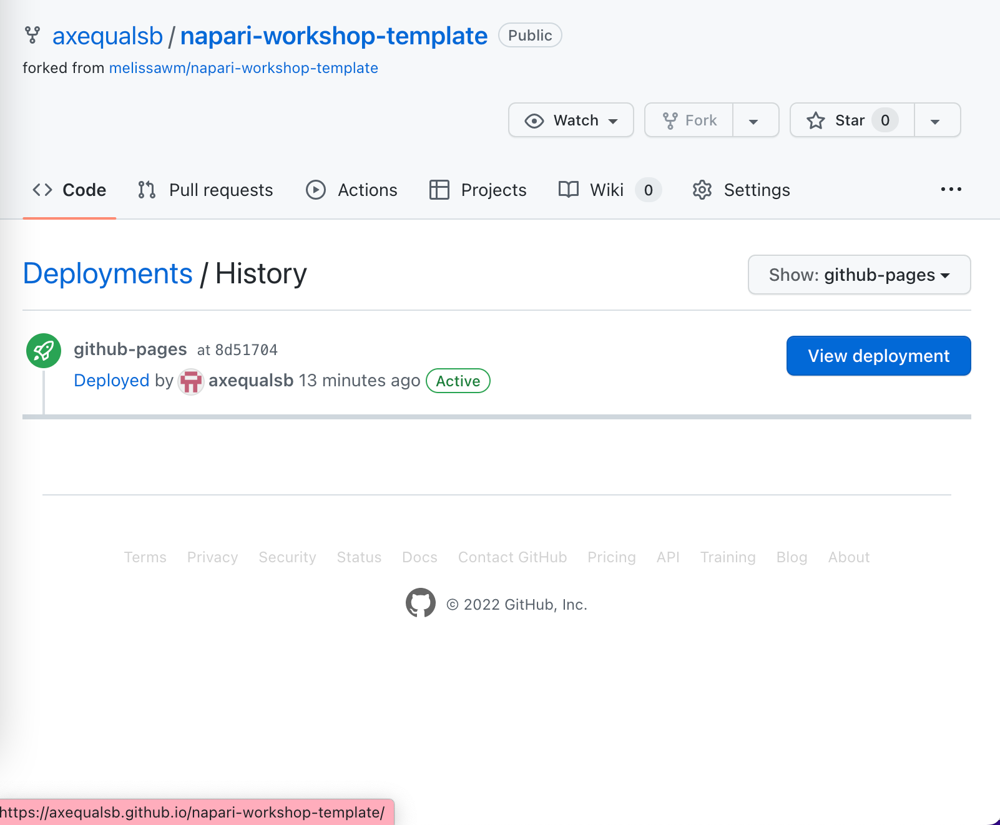

# How to deploy your workshop

To allow your workshop materials to be served as a web page, you can use the default setup on GitHub pages. Please note that, if this is the first time you are activating the GitHub pages service for your account, further steps may be necessary (such as adding a Personal Access Token to your profile.) Please consult the [GitHub pages documentation](https://docs.github.com/en/pages) for details.

Because there is already a GitHub action workflow configured under `.github/workflows` in your fork to deploy the website, you only need to enable it on your fork.

To do this, follow the steps below. **You will only need to do this once per fork.**

1. In your fork's GitHub page, look for the "Actions" tab.

   

2. Enable the deployment workflow by clicking the button labeled "I understand my workflows, go ahead and enable them."

   

3. Since no workflows were run before, you will see an empty workflows page. You can now click the "Select workflow" dropdown and then click on the pre-configured workflow called "Deploy static content to Pages".

   

4. In the resulting page, click "Run workflow" to open the workflow menu, and again click "Run workflow".

   

5. Going back to the main page of the repository, on the right you will see a `github-pages` environment has appeared. This workflow will run, and you can click on it to see the details.

   

6. Finally, after the run is finished and if it is successful, clicking on the `github-pages` environment will take you to a page where you can click "View deployment" to verify your pages were correctly built and deployed.

   

7. From now on, every time you commit changes to the main branch of your repository, this process will happen automatically and your deployment at `https://<your-username>.github.io/` will be updated accordingly.
