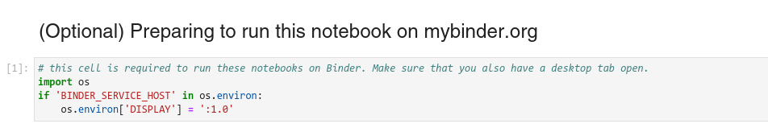

# How to open your notebooks using [mybinder.org](https://mybinder.org)

If you can't install the Jupyter notebook application locally, or if you prefer using a cloud instance of Jupyter to execute and interact with your workshop notebooks, you can follow this guide.

## Open a single notebook in Binder

To open a single notebook in Binder, click the rocketship badge at the top of each notebook, and click on "Binder".

## Open desktop tab

Because napari is a desktop application, we need a "Desktop" tab to see the napari GUI interface. In the Jupyter launcher tab, click on "Desktop".

After this, you should see a new tab open up in your browser window called "noVNC", with a basic desktop interface.

By moving your mouse pointer inside this desktop interface, you should be able to interact with it. We will use it to host the napari GUI window.

## Run notebook cells

Now that our desktop is set up, we can proceed to running each of the cells in the notebooks.

To open a notebook from this Jupyter interface, right click the notebook name in the file navigation panel from the Jupyter interface, and click "Open with -> Notebook".

You will note that these notebooks contain a code cell which needs to be run to enable the Binder interface. 

Note that every napari operation will be shown in the desktop tab of your browser, and will only be visible in the notebook interface after the `nbscreenshot` function is called. After running any cell which opens the napari viewer from the Jupyter notebook, you should now see the napari GUI window in the Desktop tab on your browser.

## Interact with the notebook!

You should now be able to interact with this notebook, by executing all cells and observing the results in the napari GUI window. You can also edit the code cells to experiment with different napari concepts and its API.