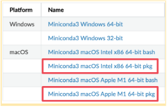
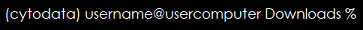

# Installing and opening napari

This workshop walks you through the following topics and exercises: 

* This topic (Install napari) - 15 minutes
* [Explore the viewer](intro-to-napari-workshop-guide-2-explore-the-viewer.md) - 15 minutes
* [Plugins](intro-to-napari-workshop-guide-3-plugins.md) - 15 minutes
* [Complete a workflow](intro-to-napari-workshop-guide-4-complete-a-workflow.md) - 15 minutes
* [Jupyter notebooks and napari](intro-to-napari-workshop-guide-5-jupyter-notebooks-and-jupyter-lab.md) - 30 minutes
* [Resources](intro-to-napari-workshop-guide-6-resources.md)

This topic covers the following:

* [Install an environment manager](#install-an-environment-manager)
* [Create an environment](#create-an-environment)
* [Enter or activate the environment](#enter-or-activate-the-environment)
* [Install napari](#install-napari)
* [Open and close napari](#open-and-close-napari)

Although napari has a bundled app, the current recommended installation method requires some work with terminal or command prompt. Follow the steps below, copying and pasting the commands into terminal/command prompt when noted.

## Install an environment manager

  

### Mac users: 
- Find the processor version: **Apple** > **About this Mac**.  
- Download the [miniconda3](https://docs.conda.io/en/latest/miniconda.html) package file (Intel or M1 depending on your computer).   
**Note:** Please use the package file which is outlined in red in the above graphic and not the bash file.  
- Open the downloaded file and follow the instructions to install.
- Search for terminal and open the terminal.   

### Windows users:
- Find the processor bit version:  
**Start button** > **Settings** > **System** > **About** shows the processor bit version.
- Download the [miniconda3](https://docs.conda.io/en/latest/miniconda.html) file (64-bit or 32-bit depending on your computer). 
- Open the downloaded file and follow the  instructions to install.
- Click the **Start** button and search for Anaconda.
- Open the **Anaconda Prompt**.

## Create an environment 
The environment can be named “napari-env” (or any other name you’d like). To create an environment, in terminal (Mac) or Anaconda Prompt (Windows), type: 

```bash
conda create -y -n napari-env -c conda-forge python=3.9
```

## Enter or activate the environment 

Enter these commands on the terminal (Mac) or at the Anaconda Prompt (Windows): 

```bash
conda activate napari-env
```

**Note:** The environment is shown on the left end of the command line. In the example below, the environment is called `cytodata`:  

  

## Install napari 
Type one of the following commands on the terminal (Mac) or at the Anaconda Prompt (Windows) and respond to the prompts:  

* Recommended command: 

  ```bash
  conda install -c conda-forge napari=0.4.17
  ```

   **Note:** 0.4.17 can be replaced with any desired version of napari.

* Alternative command if the above fails:
    ```bash
  pip install “napari[all]”
    ```

## Open and close napari  
Open napari from the terminal (Mac) or the Anaconda prompt (Windows) by typing: 

```bash
napari
```

**Note:** napari may take some time to open the first time.

OPTIONAL - Try closing and reopening napari.
* To close napari:
    - In the napari top-bar or main menu:   
    **File** > **Close Window**
    - Leave/deactivate the environment in the terminal or Anaconda Prompt by typing:  
    ```conda deactivate ```
* To enter the environment and open napari  
    - At the terminal or Anaconda Prompt type:  
    ```conda activate napari-env```  
    ```napari```

The next topic in this workshop is [Explore the viewer](intro-to-napari-workshop-guide-2-explore-the-viewer.md).  It should take approximately 15 minutes to complete. 