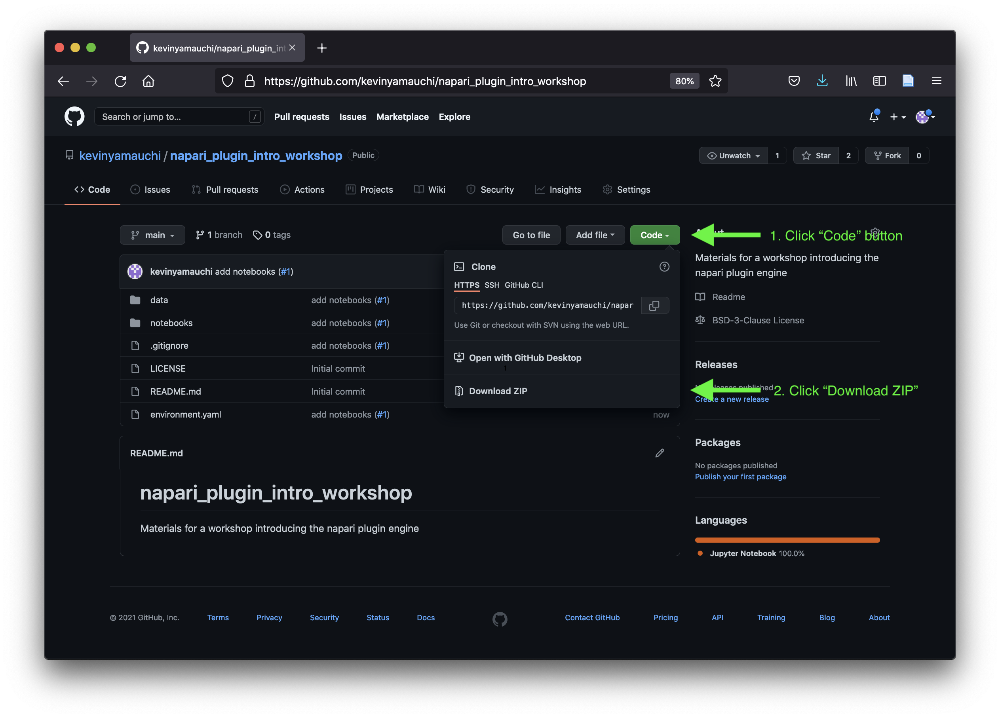
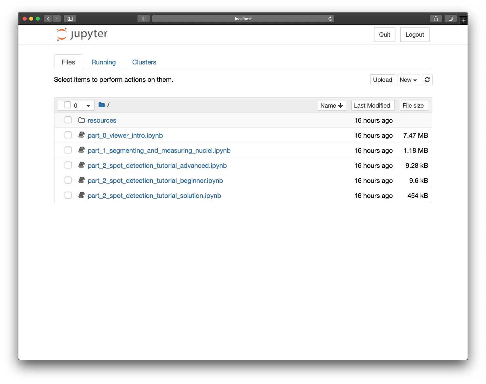

# Downloading and launching this workshop's Jupyter notebooks

During this tutorial, we will be working through a set of Jupyter notebooks. On
this page, we will download the notebooks and launch the `jupyter notebook`
application. 

## Downloading the notebooks

There are two ways to download the notebooks; follow the instructions below for
either downloading a .zip file (recommended for beginners) or cloning via git.

### Downloading .zip
To download the notebooks as a .zip file, do the following:

1. Navigate your web browser to the workshop's github repository (for this
   template, this is https://github.com/napari/napari-workshop-template)
2. Click the green "Code" button to open the download menu and then
   "Download ZIP" 
3. Choose the location you would like to download the .zip into.
4. Open your file browser and double click on the .zip file to uncompress it.
5. You have downloaded the notebooks! Proceed to the "Launching jupyter
   notebook" section.

### Cloning via git
To clone the repository containing the tutorial materials to your computer, open
your Terminal and navigate to the folder where you will download the course
materials into. We recommend cloning the materials into your Documents folder,
but you can choose another suitable location. 

 ```bash
 cd ~/Documents
 ```

Then, clone the repository. This will download all of the files necessary for
this tutorial.

 ```bash
 git clone https://github.com/napari/napari-workshop-template.git
 ```

## Launch the `jupyter notebook` application

Open your terminal and navigate to the `notebooks` subdirectory of the
`napari-workshop-template` directory you just downloaded.

```
cd <path to napari-workshop-template>/notebooks
```

Now activate the `napari-tutorial` conda environment you created in the 
installation step.

```
conda activate napari-tutorial
```

To start the Jupyter Notebook application, enter

```bash
jupyter notebook
```

Jupyter Notebook will open in a browser window and you will see the following
notebooks:

- `part_0_viewer_intro.ipynb`: in this activity, you will gain familiarity with
  loading and viewing images in napari.
- `part_1_segmenting_and_measuring_nuclei.ipynb`: in this notebook, you will use
  cellpose to segment nuclei and scikit-image to measure them.
- `part_2_spot_detection_tutorial_beginner.ipynb`: this is the spot detection
  notebook for people new to image processing with Python
- `part_2_spot_detection_tutorial_advanced.ipynb`: this is the spot detection
  notebook for people with experience performing image processing with Python
- `part_2_spot_detection_tutorial_solution.ipynb`: this is the solution to the
  spot detection activity.

All of the "part 2" notebooks cover the same activities, with different levels
of engagement required to reach the solution. For your convenience, we have
rendered the solutions to these notebooks in the following pages.


