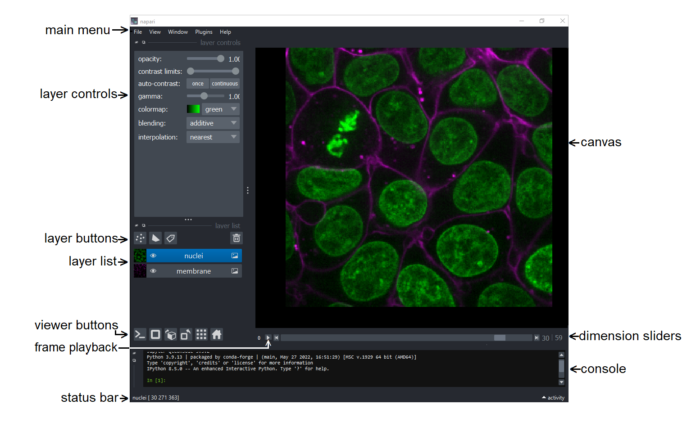
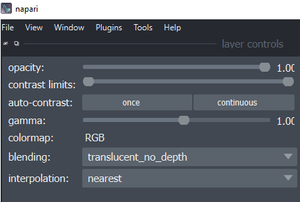

# Visualizing Data in napari

  

This module covers the following topics:
* [Open an Image](#open-an-image)
* [Explore Images in 2D and 3D](#explore-images-in-2d-and-3d)  
* [Explore Stack Manipulation](#explore-stack-manipulation)  
* [Explore Layer Types](#explore-layer-types)  
* [Install Your First Plugin](#install-your-first-plugin)

## Open an Image
  
* Open a sample image that comes with napari by selecting:  
**File**>**Open Sample**>**napari**>**Cells (3D + 2Ch)**  

   **Note:** Open one of your own images with:  
**File** > **Open files** and select a tif, png, or jpg file to open. 

## Explore Images in 2D and 3D  

* Toggle layers on and off with the **eye button next to the layer name** in the layer list.  
* Use the dimension sliders beneath the canvas to  control the z position/slice number. Slide through the 3D stack one 2D slice at a time.  

* Scroll (use two finger scroll on a touchpad) to zoom in and out.  

* Click and drag to move the images in the canvas.  

* Press the home button to bring the image back to the center of the canvas.  
  
It is on the right end of the row of viewer buttons.  

* Move the _nuclei_ and _membrane_ images to side by side by toggling the grid mode button.  
  
It is second from the right end on the row of viewer buttons.  

* Explore images in 3D by toggling the 2D/3D button.  When you're in 2D mode, it looks like this:  
  
When you're in 3D mode, it looks like this:  
  
It is second from the left end on the row of viewer buttons.
* Click and drag on the 3D image to rotate.
* Shift + click and drag to translate (move) the 3D image.  
* Scroll to zoom in and out of the 3D volume.
* Move the **nuclei** and **membrane** 3D volumes side by side by toggling the grid mode button. (Fifth button on the lower left bar).
* Toggle back to 2D mode (Second button on the lower left bar).  
 
## Adjust Image Visualization   
* Select an image from the layers list (selected images are blue in the layer list).  
* Adjust the contrast limits by control+click(Mac) or right-click(Windows) on the contrast limits slider in the layer controls section  
  
 to open the expanded view with min and max pixel values labeled on the ends of the slider.  
* Adjust opacity, color map, and blending  in the layer controls menu.  
* Open the integrated console with the first button on the row of the viewer control buttons.  
    
* Adjust the scale of the image. Enter the commands one line at a time with an indent on the second line as shown below: 

    ```Python
    for layer in viewer.layers:  
        layer.scale = [0.35, 0.2, 0.2]
    ```

    **Note:** If you cannot find your images in the canvas, toggle grid mode on and off - napari doesn’t hold images next to each other in grid mode when you change their properties.  

* Add a scale bar using **View** > **Scale Bar** > **Visible** or by typing `viewer.scale_bar.visible = True`  
in the integrated console. 
* Add physical units of microns to the scale bar by typing `viewer.scale_bar.unit = "um"`  
in the integrated console.

## Explore Stack Manipulation  
* Select both the _nuclei_ and _membrane_ layers in the layer list using **shift**+click.  
* Control+click(Mac)/right-click(Windows) either of the selected layers to open the layer actions menu.  
    * Click **Link Layers** to be able to control layers properties of both layers using the layer control panel.  

      **Note:** Unless layers are linked, changes in the layer control panel will only affect the selected layer, and when multiple layers are selected the layer control panel will not be not visible even when layers are linked.  

    * Select either layer and adjust the contrast limits of the linked layers  
    * Unlink layers  
    * Toggle to 2D mode  
    * Merge layers:	
        * Set interpolation of both layers to **nearest**. (There may be an error with **linear** mode).  
        * Select both layers and click **Merge to Stack** to combine the **nuclei** and **membrane** layers to make a single layer with an additional slider that controls the channel axis.  
    * Rename this layer to **cells** by double clicking the layer in the layer list and replacing the text.  
    * Rename the sliders **Ch** and **Z** by double clicking the **0** and **1** on the left side of the sliders and replacing the text.  
    * Explore the data using the sliders.  
    * Open the layer action menu and split the stacks with the **Split Stack** command.  

         **Note:** **Split Stack** divides a layer in its first listed dimension (proper metadata will have [channel, z, y, x]), so selecting the newly merged layer will separate the channels into separate layers, and applying **Split Stack** to one of the resulting layers will split the layer into a set of 2D layers for each of the z slices. (Error for **linear** interpolation.)
         
## Explore Layer Types  
* Add a points, shapes, or labels layer using the buttons above the layers list.
    * These layers will be blank to begin with.  
    * In 2D mode, use the layer controls to add points, draw shapes, or color on your image (referring to points, shapes, and labels layers respectively).  

      **Note:** These layers can be used for annotation of images.  
* Delete all layers in the layer list by selecting one layer, and then pressing Command+A(Mac) / Control+A(Windows) to select all layers. Then click the trash can button on the top right of the layer list. 

## Install Your First Plugin  
* Navigate to napari-hub.org - this is the platform to discover and share plugins.  
* Search for **sample:**.
* Scroll down until you see **napari-bio-sample-data**.  
* Select **napari-bio-sample-data**.  
* Read the documentation on the plugin page.  
* In napari, open  
**Plugins**>**Install/Uninstall Plugins...**   
and wait for the plugin list to populate.  
* Search for **sample** in the top search bar, and click the install button next to **napari-bio-sample-data**.  

    **Note Potential Error:** After clicking the install button and allowing the **installing…** process to complete, the plugin may still show in the **Available Plugin** list. If this happens, close napari and reopen it, then  continue.  

* Check if the plugin installed by opening **File**>**Open Sample**.  **napari-bio-sample-data** should be a menu option.  

    **Note:** Some plugins won’t populate their features until napari has been re-opened.  Reopen napari if needed.  
  
* **File**>**Open Sample**>**napari-bio-sample-data**>**3D nuclei**  
    * Select the **nuclei label** labels layer.
    * **Control+click**(Mac)/**right-click**(Windows) to open the layer actions menu and click the **Convert to Image** option which converts labels layers to image layers.  

       **Note:** **Convert to Labels** converts an image layer to a labels layer. 

    * **Control+click** (Mac)/**right-click** (Windows) on the nuclei image layer and make a max projection by **Projections**>**Max projection**.  

       **Note:** The sliders for the highest dimensionality layer (e.g. a 3D layer in a layer list with other 2D layers) will always be visible on the viewer even when other layers of fewer dimensions are being viewed. In this case, the nuclei max-projection is a 2D image, so moving the slider does not update the canvas display and the same 2D image is visible at every slider position.  
    
    * Delete all layers in the layer list using the trash can button on the top right of the layer list.  

The next module in this workshop is [Plugins](plugins.md). It takes about 15 minutes to complete. 
